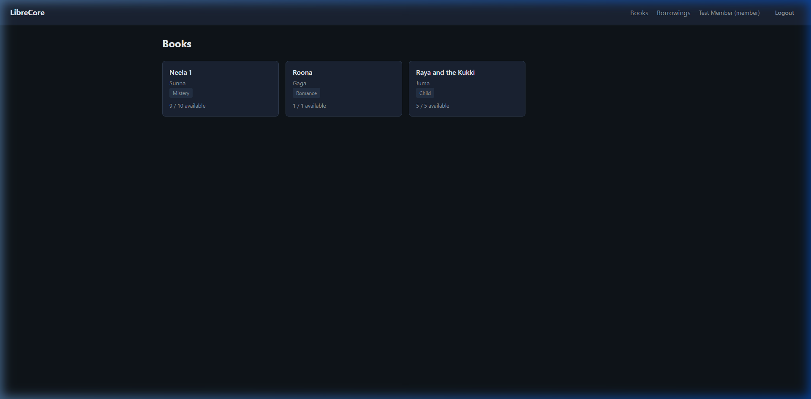
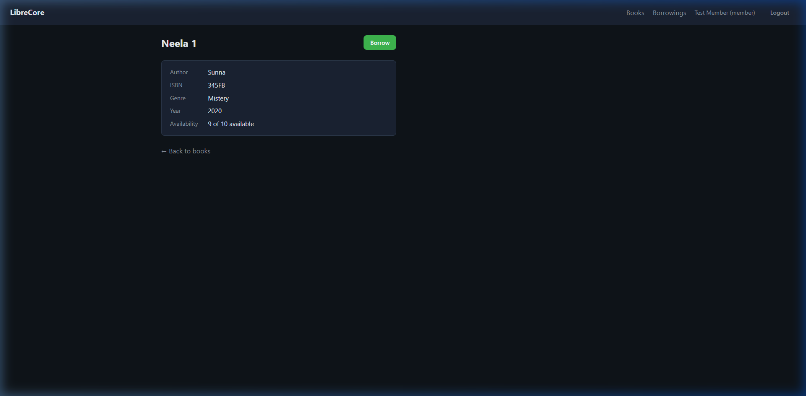
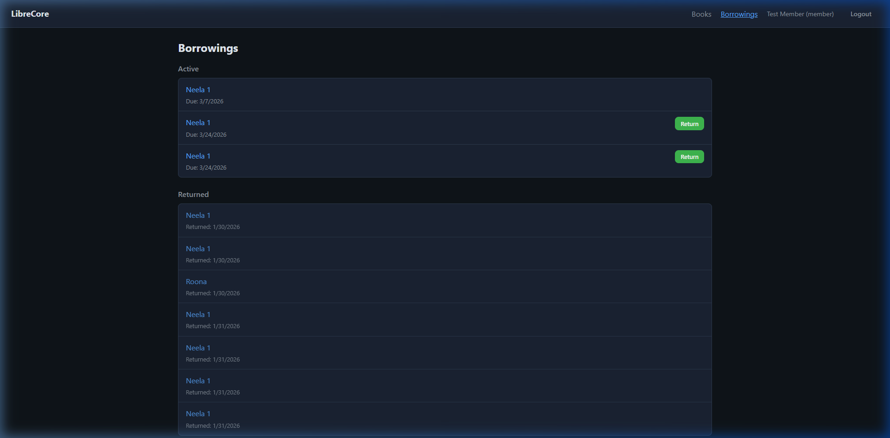
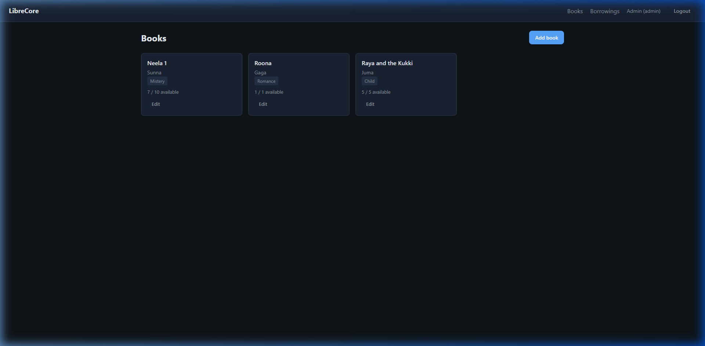
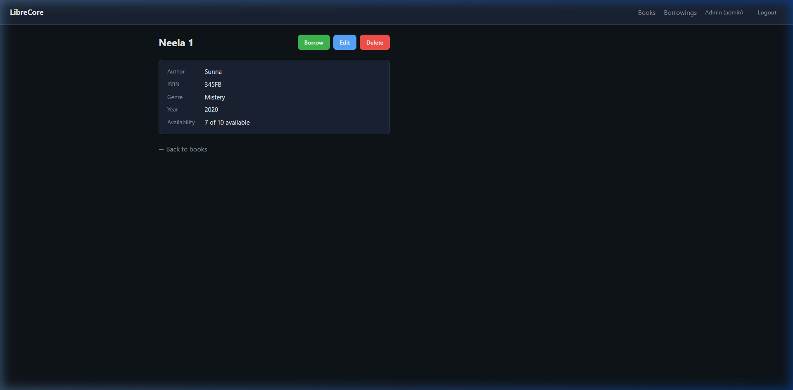
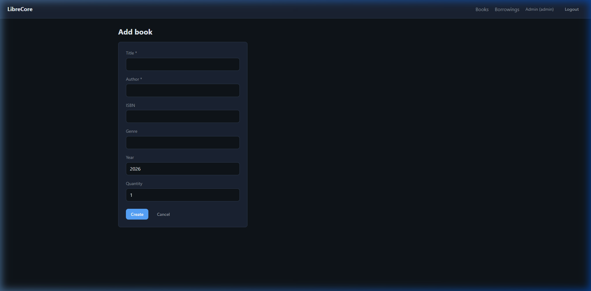
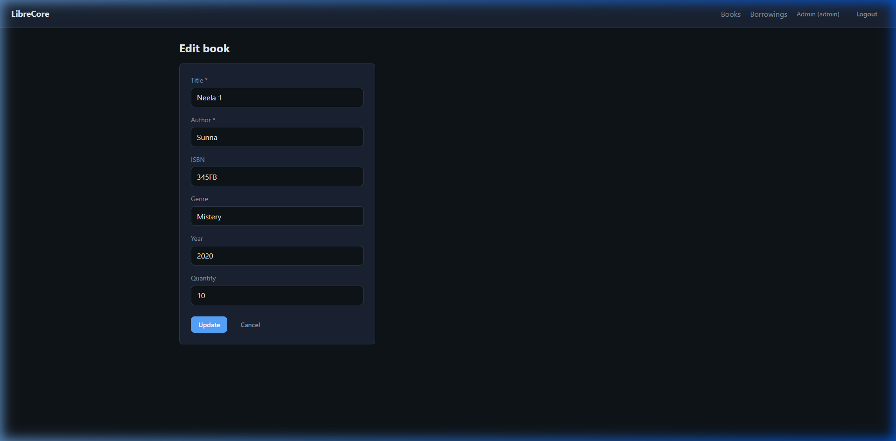
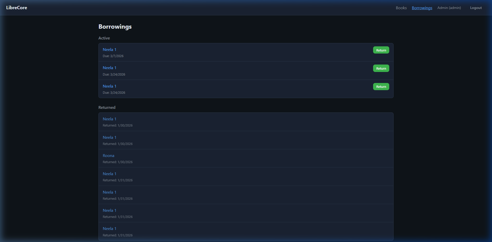

<p align="center">
  
  
  
  
  
  
  
  
</p>

# 🧩 LibreCore

> **A Modern, Real-time Library Management System**

LibreCore is a **distributed Web Application** designed to **efficiently manage library books, user accounts, and borrowings with real-time synchronization**.

The system focuses on **real-time collaboration, a clean user interface, and robust role-based access control** and aims to **provide a seamless experience for library members to borrow books and for administrators to consistently manage inventory**.

---

# ✨ Key Features

| Feature | Description |
|---|---|
| Real-time Synchronization | Book availability and updates are broadcasted instantly to all connected clients via WebSockets, preventing conflicts. |
| Role-Based Access Control | Secure, distinct access tiers for Administrator, Librarian, and Member roles using JWT authentication. |
| Comprehensive Book Management | Full CRUD operations for the library catalog, enabling staff to add, edit, and remove inventory seamlessly. |
| Streamlined Borrowing System | Intuitive flow for members to borrow and return books with automated due dates and active availability tracking. |
| Distributed Architecture | Backed by a Node/Express server and NoSQL store, allowing execution across multiple network nodes. |
| Responsive Design | Modern, accessible user interface built with React and a customized, cohesive CSS design system. |

---

# 🎬 Project Demonstration

The following resources demonstrate the system's behavior:

- 📸 [Screenshots of key features](#-screenshots)
- ⚙️ [System architecture overview](#%EF%B8%8F-architecture-overview)
- 🧠 [Engineering lessons](#-engineering-lessons)
- 🔧 [Design decisions](#-key-design-decisions)
- 🗺️ [Roadmap](#%EF%B8%8F-roadmap)
- 🚀 [Future improvements](#-future-improvements)
- 🛠️ [Installation & Database Setup](#%EF%B8%8F-installation--database-setup)
- 📝 [License](#-license)
- 📩 [Contact](#-contact)

If deeper technical access is required, it can be provided upon request.

---

# 📸 Screenshots

| Public Login |
|---------------|
|  |

| Public Register |
|---------------|
|  |

| Member Dashboard |
|---------------|
|  |

| Member Book Detail |
|---------------|
|  |

| Member Borrowings |
|---------------|
|  |

| Admin Dashboard |
|---------------|
|  |

| Admin Book Detail |
|---------------|
|  |

| Admin Add Book |
|---------------|
|  |

| Admin Edit Book |
|---------------|
|  |

| Admin Borrowings |
|---------------|
|  |

---

# ⚙️ Architecture Overview

LibreCore is implemented using a **distributed Client-Server Event-Driven Architecture**.

### Frontend
- React 18 (Component-based UI)
- TypeScript (Static Typing)
- React Router DOM (Client-side Routing)
- Vite (Build Tool & Dev Server)

### Backend
- Node.js (Runtime Environment)
- Express.js (REST API Framework)
- PouchDB / MongoDB (NoSQL Document Database)

### Communication
- RESTful HTTP API (Primary data fetching and authentication)
- WebSockets (`ws` library) (Real-time bi-directional event broadcasting)

### Local Persistence & Security
- LocalStorage (JWT token and user session state)
- Bcrypt (Server-side password hashing)
- JWT (Stateless authentication tokens)

---

# 🧠 Engineering Lessons

During development of LibreCore the focus areas included:

- **Implementing Real-time State Reconciliation**: Leveraging WebSockets over HTTP polling to broadcast database changes and instantly update React state across all connected clients globally.
- **Secure Authentication Lifecycles**: Managing JWT creation, secure HTTP headers, and protecting React DOM routes securely based on hydrated user roles.
- **End-to-End Type Safety**: Ensuring strict interfaces between the Express backend models and React frontend components using shared TypeScript typings.
- **Custom CSS Architecture**: Building a highly cohesive and visually impressive design system using native CSS variables and scoped styles without relying on bloated, heavy external UI frameworks.
- **Distributed Build Pipelines**: Architecting the Vite production build to be easily intercepted and served statically by the Express node backend, simplifying deployment infrastructure.

---

# 🔧 Key Design Decisions

1. **WebSocket Integration over HTTP Polling**

   Chose native WebSockets to push book availability changes instantly to all connected network clients, critically preventing double-booking edge cases and vastly reducing server load compared to aggressive short-polling.

2. **NoSQL Document Database (MongoDB/PouchDB)**

   Opted for a schema-less NoSQL database approach to easily accommodate heterogeneous book metadata and future-proof the entities without complex SQL migrations during the rapid prototyping phase.

3. **Vanilla CSS Variables over Frameworks**

   Avoided heavy UI component frameworks (like Material UI or Bootstrap) to maintain a lightweight JavaScript bundle and achieve granular, pixel-perfect control over the bespoke `LibreCore` visual identity.

4. **Stateless JWT Authentication**

   Selected JSON Web Tokens over stateful session cookies to ensure the backend remains completely stateless, allowing for horizontal scaling of the Node.js instances in a load-balanced production environment.

---

# 🗺️ Roadmap

Key upcoming features planned for LibreCore:

- **[Done]** User Authentication & Roles — JWT-based login, register, and RBAC implementation.
- **[Done]** Real-time Book Catalog — WebSocket synced book inventory and availability.
- **[In Progress]** Advanced Search & Filtering — Search books by genre, author, and quantity.
- **[Not Started]** Email Notifications — Automated reminders for upcoming due borrowings via SendGrid.
- **[Not Started]** Docker Containerization — Containerizing the entire MERN stack for easier, isolated deployments.

---

# 🚀 Future Improvements

Planned enhancements include:

- Automated database backups and cron-job exports to cloud storage.
- External integration with public indexing APIs (e.g., Google Books API) for automatic book metadata and cover image fetching.
- Member profile customization including avatars and borrowing history analytical graphs.
- Migrating real-time functionality to a managed Pub/Sub service for massive horizontal scale.
- Implementing an automated CI/CD pipeline leveraging GitHub Actions.

---

# 🛠️ Installation & Database Setup

### 1. Download via GitHub
Clone the repository locally:
```bash
git clone https://github.com/VirajTharindu/LibreCore.git
cd LibreCore
```

### 2. Database Configuration (MongoDB)
LibreCore uses a NoSQL document store. To configure a local or Atlas MongoDB connection:
1. Ensure MongoDB is installed locally or create a free cluster on MongoDB Atlas.
2. Create a `.env` file in the `server/` directory.
3. Add your connection URI:
   ```env
   MONGO_URI=mongodb+srv://<username>:<password>@cluster.mongodb.net/librecore?retryWrites=true&w=majority
   JWT_SECRET=your_super_secret_key_here
   ```
*(Note: The current iteration utilizes PouchDB for instant zero-config startup, but the adapters are designed to plug directly into MongoDB collections seamlessly).*

### 3. Running via Docker (Coming Soon)
```bash
docker-compose up -d --build
```

### 4. Manual Local Setup
**Backend:**
```bash
cd server
npm install
npm run dev
```

**Frontend:**
```bash
cd client
npm install
npm run dev
```
Open `http://localhost:5173` in your browser.

---

## 📄 Documentations

Additional documentation is available in the `docs/` folder:

| File | Description |
|---|---|
| ["Screenshots"](docs/screenshots) | Visual artifacts of the system in action representing all core workflows. |

---

# 📝 License

This repository is published as an **Open Source project**.

It is licensed under the **MIT License**. Permission is hereby granted, free of charge, to any person obtaining a copy of this software and associated documentation files, to deal in the Software without restriction, including without limitation the rights to use, copy, modify, merge, publish, distribute, sublicense, and/or sell copies of the Software.

© 2026 Viraj Tharindu — Open Source.

---

# 📩 Contact

If you are reviewing this project as part of a hiring process or are interested in the technical approach behind it, feel free to reach out.

I would be happy to discuss the architecture, design decisions, or provide a private walkthrough of the project.

**Opportunities for collaboration or professional roles are always welcome.**

📧 Email: [virajtharindu1997@gmail.com](mailto:virajtharindu1997@gmail.com)  
💼 LinkedIn: [https://www.linkedin.com/in/viraj-tharindu/](https://www.linkedin.com/in/viraj-tharindu/)  
🌐 Portfolio: [Visit my portfolio](#) <!-- Replace "#" with your actual portfolio URL -->  
🐙 GitHub: [https://github.com/VirajTharindu](https://github.com/VirajTharindu)  

---

<p align="center">
  <em>Engineering Excellence in Web Development</em>
</p>
